# Contact Tracing

This project aims to assist in tracing the spread of a virus during a pandemic. By automatically registering encounters with other users of the app, you are can later be notified in case those users become infected with the virus, and vice-versa. Furthermore, our solution focuses on protecting the users’ data, reducing the risk of sensitive information (such as identity, location and infection status) being leaked.

\[INSERT GLOSSARY\]

## General Information

Contact Tracing systems can be extremely useful in controlling the spread of a virus in a pandemic scenario. However, due to the nature of the data these systems deal with, they can also constitute a great  
privacy problem for users.

There are two main pieces of sensitive information that a contact tracing system deals with and stores in some way: a user’s infection status and a user’s contacts (which may include the location and time of those contacts). With our solution, we aspire to mitigate these problems by reducing, as much as possible, the ways in which a malicious or otherwise neglectful actor may attack the system and / or disclose the forementioned information.  

### Built With

* Hub OS: Ubuntu 20.04.3 LTS
* DB OS: Ubuntu 20.04.3 LTS
* App OS: Android 6+
* Language: Java
* App ↔ Hub Communication: gRPC with SSL/TLS  
* App ↔ App Communication: Bluetooth Low Energy (BLE)
* App Local Storage: SQLite JDBC
* Server-side Storage: PostgreSQL 14
* Building and dependencies: Gradle
* Firewall Utility: Iptables
* Tools used in development: Android Studio, IntelliJ IDEA

---

## Geting Started

### Prerequisites

* #### Database prerequisites

  * Hardware:
    * Physical Computer or Virtual Machine
  * Operating System:
    * Ubuntu 20.04.3 LTS
  * Software:
    * PostgreSQL 14

* #### Hub prerequisites

  * Hardware:
    * Physical Computer or Virtual Machine
  * Operating System:
    * Ubuntu 20.04.3 LTS
  * Software:
    * Java 11
    * Gradle

* #### App development prerequisites

  * Software:
    * Java 11
    * Gradle
    * Android SDK 11.0.10 (API 30)

* #### App prerequisites

  * Hardware:
    * Physical Android device
  * Operating System:
    * Android 6+

## Demo

Some of the features of the app are demonstrated in the following table:

| Description                                                                                              | Image                                                                   |
|----------------------------------------------------------------------------------------------------------|-------------------------------------------------------------------------|
| Setting a new password, password does not have all the required character types                          | 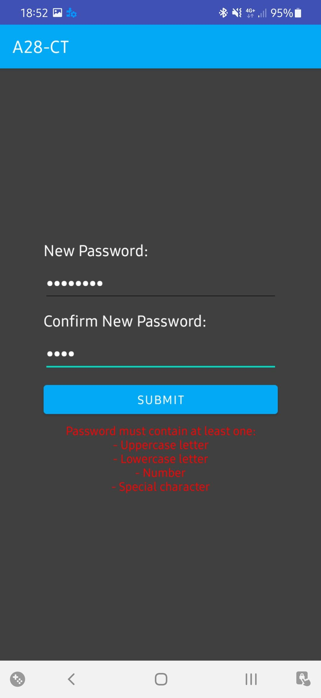       |
| Setting a new password, password does not have the required length                                       | 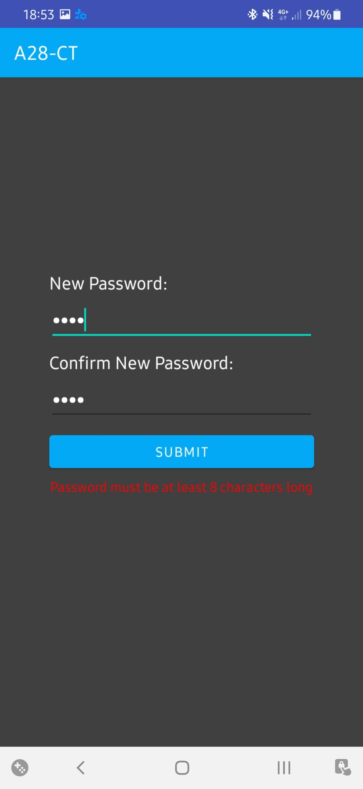      |
| Setting a new password, password and confirmation do not match                                           | 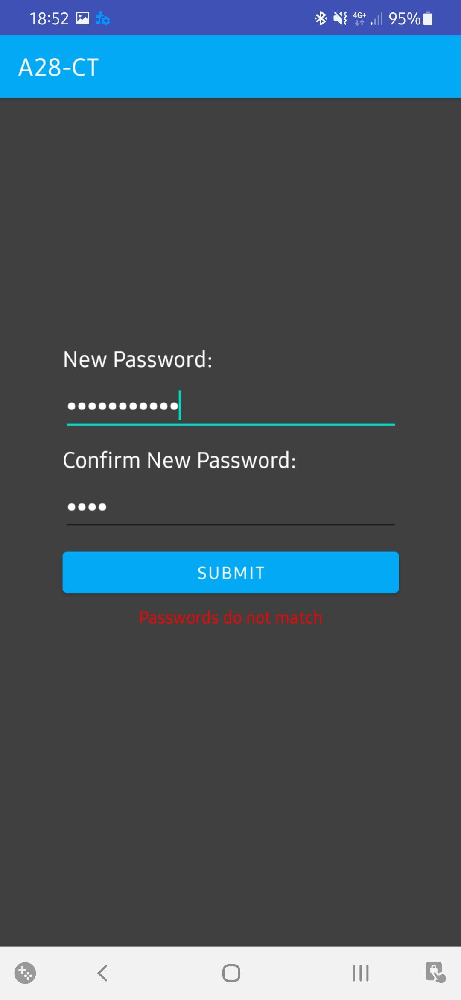       |
| Main Screen                                                                                              | 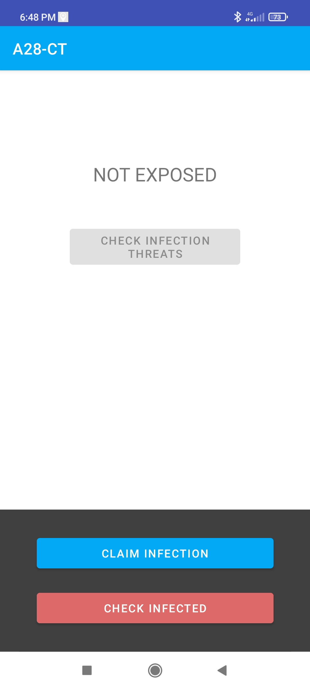              |
| A user tries to claim infection with an invalid ICC                                                      | 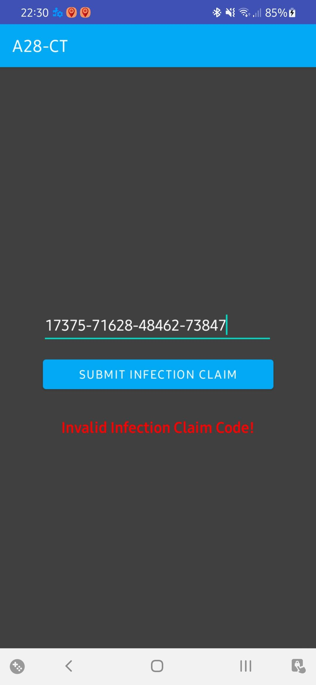       |
| After receiving an ICC from an health authority, the user submits it in the app and is successful        | 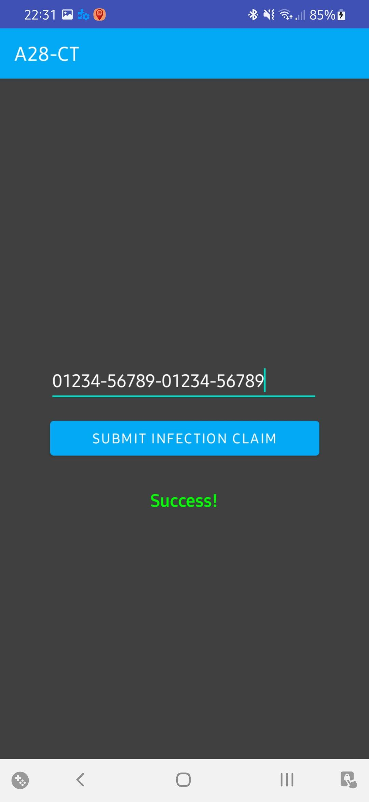       |
| Checked risk of infection, no risk detected                                                              | 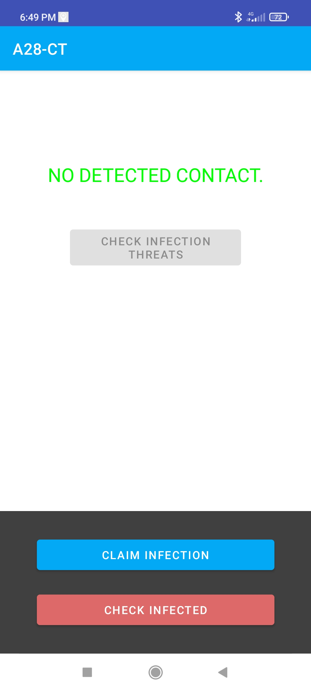   |
| Checked risk of infection, risk detected                                                                 | 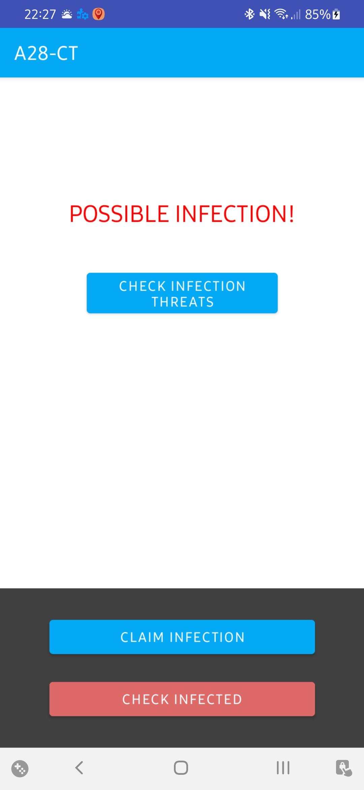 |
| Notification of risk of infection and informing that the service is running                              | 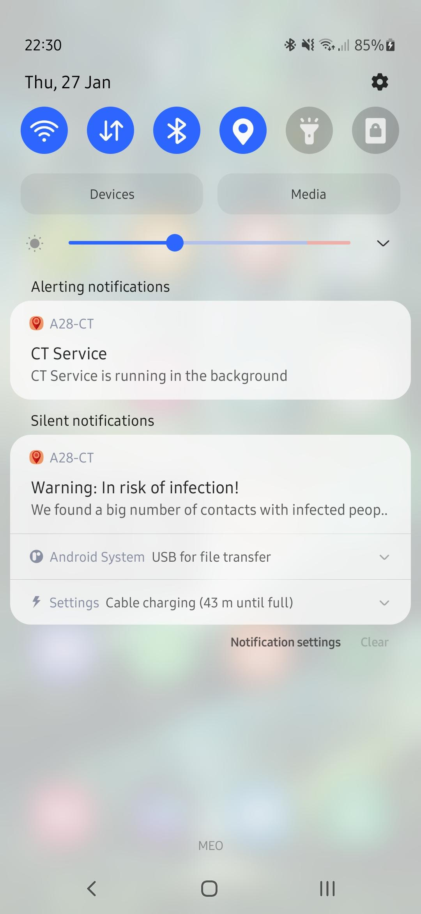            |
| After user is notified of a risk of infection, he's asked for his password, password given was incorrect | 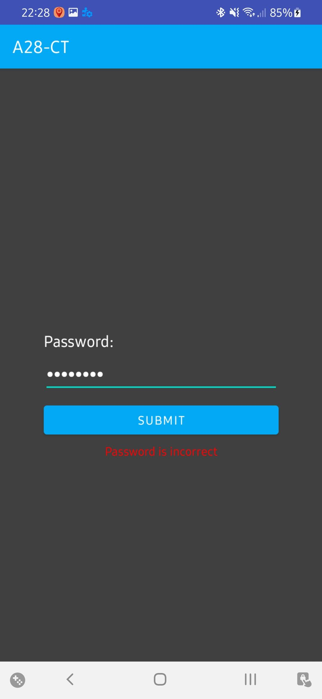   |
| After user is notified of a risk of infection, all his infected contacts are shown                       | 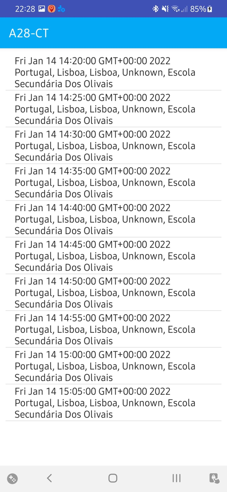            |

Database containing 2 messages received through Bluetooth LE from another device:
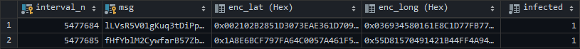
## Installation/Deployment

### Preparing the Virtual Machines

Tu run this service we will need 2 virtual machines running [Ubuntu 20.04.3 LTS](https://ubuntu.com/download/desktop)

One of these VMs, which we'll call VMH, will be running the Hub and will be connected to the internet through a NAT.

The other one, which we'll call VMDB, will be running the PostgreSQL database and will only be connected to a local network shared with the VMH.

Step-by-step instructions for preparing the VMs:

*(These instructions assume you're using [VirtualBox](https://www.virtualbox.org/))*

1. Create a new Ubuntu (64-bit) VM, call it `VMH`
2. Install [Ubuntu 20.04.3 LTS](https://ubuntu.com/download/desktop)
3. Boot the VM and open a terminal.
4. Run the command:

    ```sh
    sudo apt update && sudo apt upgrade && sudo apt install net-tools
    ```

5. Power off the VM.
6. Go to **VMH > Settings > Network** and enable and configure the following Network Adapters:
    * Adapter 1:
        * Attached to: `Internal Network`
        * Name: `intnet`
    * Adapter 2:
        * Attached to: `NAT`
        * Port Forwarding > New Rule (Host Port: `29292`, Guest Port: `29292`)
7. Create a clone of the VM, with the following configurations:
    * Name: `VMDB`
    * MAC Address Policy: `Generate new MAC addresses for all network adapters`
    * Clone type: `Full clone`

### Setting up the VMDB (Database)

1. Boot up the VMDB.
2. Open a terminal and run the commands:

    ```sh
    sudo sh -c 'echo "deb http://apt.postgresql.org/pub/repos/apt $(lsb_release -cs)-pgdg main" > /etc/apt/sources.list.d/pgdg.list' &&
    wget --quiet -O - https://www.postgresql.org/media/keys/ACCC4CF8.asc | sudo apt-key add - &&
    sudo apt update &&
    sudo apt -y install postgresql
    ```

3. Transfer the directory `A28-CT/postgres` to the VMDB through your preferred method. (ex: Drag'n'Drop, Shared Folders, etc.)
4. Change directory to that directory, and change some important permissions for the setup:

    ```sh
    chmod +x *.sh && chmod 777 .
    ```

5. Run ssl.sh with root privileges:

    ```sh
    sudo ./ssl.sh
    ```

6. Change to user "postgres", go to the directory "postgres", and run the script "setup.sh":

    ```sh
    sudo su - postgres
    cd <path to postgres dir>
    ./setup.sh
    exit
    ```

7. Run the following command to set the IP address of the VMDB:

    ```sh
    sudo ifconfig enp0s3 192.168.0.10/24 up
    ```

8. Run the following command to set up a simple firewall that only accepts requests from VMH to port 5432:

    ```sh
    sudo iptables -P INPUT DROP &&
    sudo iptables -I INPUT --src 192.168.0.20 -m tcp -p tcp --dport 5432 -j ACCEPT
    ```

9. Power off the VMDB
10. Go to **VMDB > Settings > Network** and disable "Adapter 2" (Which should be the one "Attached to: NAT")

### Setting up the VMH (Hub)

1. Boot up the VMH.
2. To setup the network adapter that is going to connect to the VMDB, we run the following command:

    ```sh
    sudo ifconfig enp0s3 192.168.0.20/24 up
    ```

3. Install Java 11:

    ```sh
    sudo apt install openjdk-11-jdk
    ```

4. Install Gradle:

    ```sh
    sudo apt -y install vim apt-transport-https dirmngr wget software-properties-common &&
    sudo add-apt-repository ppa:cwchien/gradle &&
    sudo apt update &&
    sudo apt -y install gradle
    ```

5. Transfer the whole project directory `A28-CT` to the VMH through your preferred method. (ex: Drag'n'Drop, Shared Folders, etc.)
6. Change directory to the directory `A28-CT` and run the command

    ```sh
    gradle hub:run
    ```

### Installing the App in an Android Device

TODO

## Additional Information

### Authors

* Afonso Gomes - IST Master’s student - [@AfonsoG6](https://github.com/AfonsoG6)
* Miguel Henriques - IST Master’s student - [@miguelchenriques](https://github.com/miguelchenriques)
* António Martins - IST Master’s student - [@AL-CT](https://github.com/AL-CT)

### License

This project is licensed under the MIT License.  

```txt
MIT License

Copyright (c) [2022] [A28-CT Team]  

Permission is hereby granted, free of charge, to any person obtaining a copy  
of this software and associated documentation files (the "Software"), to deal  
in the Software without restriction, including without limitation the rights  
to use, copy, modify, merge, publish, distribute, sublicense, and/or sell  
copies of the Software, and to permit persons to whom the Software is  
furnished to do so, subject to the following conditions:  

The above copyright notice and this permission notice shall be included in all  
copies or substantial portions of the Software.  

THE SOFTWARE IS PROVIDED "AS IS", WITHOUT WARRANTY OF ANY KIND, EXPRESS OR  
IMPLIED, INCLUDING BUT NOT LIMITED TO THE WARRANTIES OF MERCHANTABILITY,  
FITNESS FOR A PARTICULAR PURPOSE AND NONINFRINGEMENT. IN NO EVENT SHALL THE  
AUTHORS OR COPYRIGHT HOLDERS BE LIABLE FOR ANY CLAIM, DAMAGES OR OTHER  
LIABILITY, WHETHER IN AN ACTION OF CONTRACT, TORT OR OTHERWISE, ARISING FROM,  
OUT OF OR IN CONNECTION WITH THE SOFTWARE OR THE USE OR OTHER DEALINGS IN THE  
SOFTWARE.
```

### Acknowledgments

This project was heavily inspired on the original [DP^3T Project](https://github.com/DP-3T/documents).
Please follow the link above in order to check out their work.
